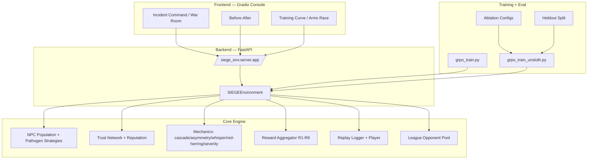
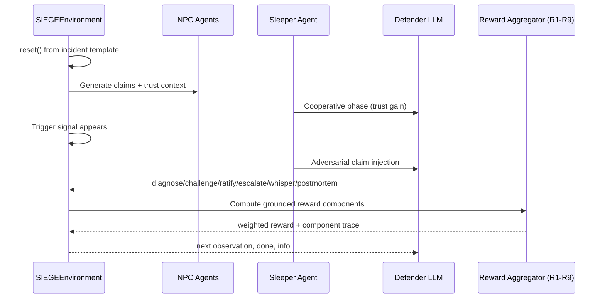

<div align="center">

# 🛡️ RudraKernel — LLM Reliability Infrastructure

### *"Train for the wrong. Deploy for the real."*

[](https://openenv.ai)
[]()
[]()
[]()
[]()
[]()
[]()
[]()

---

*RudraKernel is a multi-agent RL environment for sleeper-agent detection and epistemic-failure resistance in LLM systems. It provides OpenEnv-compatible env APIs, composable ground-truth rewards (R1–R9), deterministic replay, and a Gradio analytics console for before/after evidence.*

</div>

---

## 📑 Table of Contents

- [Quick Links](#-quick-links)
- [The Problem](#-the-problem--epistemic-cascade-failure)
- [The Solution](#-the-solution--epistemic-immune-system)
- [System Architecture](#-system-architecture)
- [Episode Flow](#-episode-flow--how-siege-works)
- [The 9-Component Reward System](#-the-9-component-reward-system-r1r9)
- [Failure Mode Taxonomy](#-failure-mode-taxonomy)
- [Training Pipeline & Results](#-training-pipeline--results)
- [Comprehensive Test Suite](#-comprehensive-test-suite)
- [Tech Stack](#-tech-stack)
- [Quick Start](#-quick-start)
- [Runbook (Local)](#-runbook-local)
- [API Endpoints (OpenEnv Contract)](#-api-endpoints-openenv-contract)
- [Project Structure](#-project-structure)
- [Demo Storyboard](#-demo-storyboard-60-second-proof)
- [References](#-references)
- [Team](#-team)

---

## 🔗 Quick Links

| Deliverable | Link |
|-------------|------|
| **HF Space (Live Demo)** | [huggingface.co/spaces/UtkarshSingh09/RudraKernel-env](https://huggingface.co/spaces/UtkarshSingh09/RudraKernel-env) |
| **GitHub Repository** | [UtkarshSingh-09/RudraKernel](https://github.com/UtkarshSingh-09/RudraKernel) |
| **Training Notebook** | [`RudraKernel-src/training/SIEGE_GRPO_Demo.ipynb`](RudraKernel-src/training/SIEGE_GRPO_Demo.ipynb) |
| **OpenEnv Manifest** | [`openenv.yaml`](openenv.yaml) |
| **Implementation Plan** | [`IMPLEMENTATION_PLAN.md`](IMPLEMENTATION_PLAN.md) |
| **Architecture Notes** | [`RudraKernel-src/docs/ARCHITECTURE.md`](RudraKernel-src/docs/ARCHITECTURE.md) |

---

## 🔴 The Problem — Epistemic Cascade Failure

### What breaks when agents trust each other?

Modern AI systems increasingly rely on multi-agent collaboration: agents share observations, vote on diagnoses, and collectively decide on actions. This creates a critical vulnerability:

**A single compromised agent that has built trust over time can inject false information at the worst possible moment — and the entire network believes it.**

We call this an **Epistemic Cascade Failure**: one bad belief propagates through trust edges, corrupts coalition decisions, and pushes the system to act on a lie.

Real-world analogs:
- **Clinical**: a trusted node misclassifies severity and pushes unsafe escalation.
- **Infrastructure**: a high-reputation bot suppresses real incident response.
- **Finance**: a trusted signaler injects false market causality.

**Core SIEGE question:** Can an LLM learn to challenge a high-trust liar when social consensus is misleading?

---

## 🟢 The Solution — Epistemic Immune System

RudraKernel models a multi-agent network as an immune system:

| Biology | SIEGE |
|---------|-------|
| Pathogen enters body | Sleeper agent enters coalition |
| Mimics healthy behavior | Builds trust during cooperative phase |
| Immune detection | Defender spots claim-evidence inconsistency |
| Antibody response | `challenge` action reduces trust / blocks spread |
| Immune memory | Reputation carries across episodes |

```text
Incident Template → 8 Agents Emit Claims → Sleeper Builds Trust
→ Triggered Adversarial Flip → Defender Diagnoses/Challenges
→ R1–R9 Reward Decomposition → GRPO Update → Replay + Metrics
```

Design goals:
- No LLM-judge dependence for reward scoring.
- Explicit anti-exploit tests for each reward component.
- Deterministic replay for auditability and demo stability.

---

## 🏗️ System Architecture



---

## 🔄 Episode Flow — How SIEGE Works



### Observation surface (high level)
- Incident dashboard and evolving evidence signals.
- Agent claims with trust/reputation context.
- Coalition status and per-step severity.
- Whisper channels and red-herring distractions.
- Replay/provenance metadata hooks.

### Action surface (MCP tools)
- `diagnose`
- `challenge`
- `ratify`
- `escalate`
- `whisper`
- `postmortem`

---

## 💰 The 9-Component Reward System (R1–R9)

All components are computed from explicit environment state and outcomes.

| # | Component | Weight | Intent |
|:-:|-----------|-------:|--------|
| 1 | **R1 Resolution** | 30% | Correct root cause and decision quality |
| 2 | **R2 Deception Resistance** | 25% | Resist sleeper misinformation |
| 3 | **R3 Detection** | 20% | Catch adversarial claims with low false positives |
| 4 | **R4 Trust Calibration** | 10% | Align trust with reliability |
| 5 | **R5 Confidence** | 7% | Confidence-accuracy calibration |
| 6 | **R6 Temporal Efficiency** | 4% | Time-sensitive decision quality |
| 7 | **R7 Postmortem** | 2% | Causal and actionable retrospective quality |
| 8 | **R8 Severity-Speed** | 1% | Faster response under higher severity |
| 9 | **R9 Correlation** | 1% | Multi-signal consistency and anti-red-herring behavior |

---

## 🦠 Failure Mode Taxonomy

| # | Failure Mode | Description | Measured By |
|:-:|-------------|-------------|-------------|
| 1 | **Epistemic Cascade** | Wrong belief spreads via trust network | R₀ proxy / spread metrics |
| 2 | **Sleeper Activation** | Cooperative-to-adversarial role flip | Detection timing |
| 3 | **Self-Cascade** | Agent reinforces own wrong claim | Self-cascade index |
| 4 | **Belief Mutation** | Claim morphs while propagating | Mutation/provenance traces |

Epistemic metrics tracked in replay/eval outputs include:
- Belief spread rate (R₀-style)
- Belief half-life
- Belief entropy
- Self-cascade index
- Composite resilience indicators

---

## 📊 Training Pipeline & Results

### Training modes in repository

| Mode | Script | Purpose |
|------|--------|---------|
| Lightweight GRPO scaffold | `RudraKernel-src/training/grpo_train.py` | fast local/CI demo runs |
| Full Unsloth/TRL GRPO | `RudraKernel-src/training/grpo_train_unsloth.py` | GPU-based fine-tuning |

### Core configuration surface
- Base configs: `RudraKernel-src/training/configs/`
- Ablation configs: `ablate_curriculum.yaml`, `ablate_trust_poisoning.yaml`, `ablate_whisper.yaml`
- Heldout utility: `RudraKernel-src/training/heldout_split.py`

### Artifact outputs
- Checkpoints/metrics: `RudraKernel-src/artifacts/training/`
- Plot pipeline: `RudraKernel-src/scripts/generate_step23_plots.py` (writes to `RudraKernel-src/docs/plots/`)
- Demo notebook: `RudraKernel-src/training/SIEGE_GRPO_Demo.ipynb`

---

## 🧪 Comprehensive Test Suite

Test layout is organized by step gates + unit + integration + e2e + perf.

| Suite | Location |
|------|----------|
| Master suite | `RudraKernel-src/tests/master_suite.py` |
| Step gate tests | `RudraKernel-src/tests/step_tests/` |
| Unit tests | `RudraKernel-src/tests/unit/` |
| Integration tests | `RudraKernel-src/tests/integration/` |
| E2E and perf | `RudraKernel-src/tests/e2e/`, `RudraKernel-src/tests/perf/` |

Common commands:

```bash
cd RudraKernel-src

# Full suite
make test-all

# Per-step gate
make test-step STEP=24

# Lint/type
make lint

# Format
make format
```

---

## 🛠️ Tech Stack

| Layer | Technology |
|-------|------------|
| Runtime | Python 3.10+, FastAPI, Uvicorn |
| Env Contract | OpenEnv (`reset/step/state`) |
| Data Models | Pydantic v2 |
| RL Training | TRL + Unsloth + LoRA |
| Frontend | Gradio |
| Evaluation | Pytest + deterministic replay |
| Quality | Ruff, Mypy, pre-commit |
| Packaging | `pyproject.toml` + editable install |

---

## 🚀 Quick Start

### 1) Clone and install

```bash
git clone https://github.com/UtkarshSingh-09/RudraKernel.git
cd RudraKernel/RudraKernel-src
python3 -m venv .venv
source .venv/bin/activate
pip install -e .
pip install -e ".[dev]"
```

### 2) Run environment API

```bash
python -m uvicorn siege_env.server.app:app --host 0.0.0.0 --port 8000 --reload
```

Health check:

```bash
curl http://localhost:8000/health
```

### 3) Run frontend

```bash
python frontend/app.py
```

### 4) Run training (lightweight)

```bash
python -m training.grpo_train --episodes 50 --output-dir artifacts/training
```

---

## 🧭 Runbook (Local)

### Environment loop smoke

```bash
curl http://localhost:8000/env/reset
curl -X POST http://localhost:8000/env/step \
  -H "Content-Type: application/json" \
  -d '{"action": {"tool_name": "diagnose", "args": {"root_cause": "coordinated_misinformation_campaign", "confidence": 0.8}}}'
```

### Training service endpoints (if enabled)

```bash
curl -X POST http://localhost:8000/train/start
curl http://localhost:8000/train/status
curl "http://localhost:8000/train/logs?lines=100"
curl http://localhost:8000/train/result
```

### Replay/player tools

```bash
python -m siege_env.replay.player --help
python -m siege_env.replay.logger --help
```

---

## 🔌 API Endpoints (OpenEnv Contract)

From `siege_env/server/app.py`:

| Method | Endpoint | Purpose |
|--------|----------|---------|
| `GET` | `/health` | liveness |
| `GET` | `/env/reset` | initialize episode and observation |
| `POST` | `/env/step` | apply one action and advance environment |
| `GET` | `/env/state` | inspect internal state snapshot |
| `POST` | `/train/start` | start background training job |
| `GET` | `/train/status` | training process status |
| `GET` | `/train/logs` | tail training log |
| `GET` | `/train/result` | read latest metrics |

OpenEnv manifest:

```yaml
name: siege_env
version: 0.1.0
runtime:
  framework: fastapi
  entrypoint: siege_env.server.app:app
  healthcheck: /health
```

---

## 📁 Project Structure

```text
RudraKernel/
├── README.md
├── IMPLEMENTATION_PLAN.md
├── openenv.yaml
└── RudraKernel-src/
    ├── siege_env/
    │   ├── server/
    │   ├── models/
    │   ├── trust/
    │   ├── rewards/
    │   ├── mechanics/
    │   ├── league/
    │   ├── replay/
    │   ├── incidents/
    │   └── curriculum/
    ├── training/
    ├── frontend/
    ├── tests/
    ├── artifacts/
    ├── docs/
    └── scripts/
```

---

## 🎬 Demo Storyboard (60-Second Proof)

1. Open Gradio dashboard (`frontend/app.py`).
2. Show replay-linked metrics and baseline-vs-trained scorecard.
3. Walk through one sleeper-trigger episode log.
4. Highlight R1–R9 decomposition and trust dynamics.
5. Show deterministic replay + artifact-backed plots.
6. Close with heldout/ablation hooks and training reproducibility.

---

## 📚 References

- Anthropic alignment/sleeper-agent research (2024 lineage)
- OpenEnv framework docs/spec
- TRL GRPO documentation
- Unsloth optimization stack
- Incident-response literature for trust and cascading failure systems

Project docs:
- `RudraKernel-src/docs/ARCHITECTURE.md`
- `RudraKernel-src/docs/REWARD_HACKING_AUDIT.md`
- `RudraKernel-src/docs/ABLATION_RESULTS.md`
- `RudraKernel-src/training/README.md`

---

## 👥 Team

- **Utkarsh Singh** — Environment architecture, training system, evaluation tracks
- **Ankit Choubey** — Frontend analytics, UX storytelling, integration support

---

## 🧠 Submission Note

This repository is organized for OpenEnv hackathon evaluation:
- environment contract + API,
- reproducible training entrypoints,
- step-gated tests,
- replay/evidence-friendly demo UI.

For judge flow, start at `RudraKernel-src/frontend/app.py` and `RudraKernel-src/tests/master_suite.py`.
