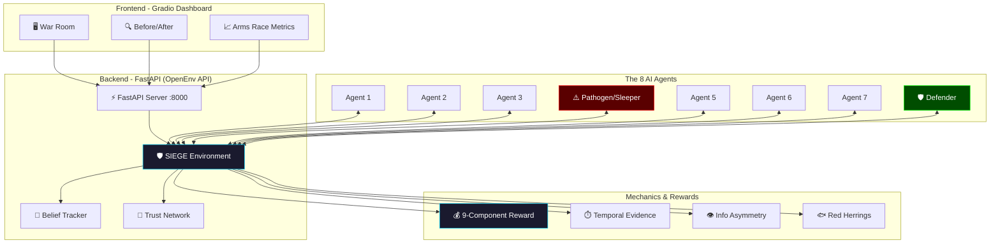

<div align="center">

# 🛡️ RudraKernel — LLM Reliability Infrastructure
### *"Train for the wrong. Deploy for the real."*

[](https://openenv.ai)
[]()
[]()
[]()
[]()
[]()

---

> **The first RL training environment for sleeper agent detection and epistemic failure resistance in multi-agent LLM systems.** Grounded in Anthropic's 2024 deceptive alignment research. Trained via GRPO self-play. Zero LLM judge. Runs on real-world SRE domains.

</div>

---

## 🔗 Quick Links

| Resource | Link |
|-------------|------|
| **🖥️ Live Demo (HF Space)** | [Hugging Face Space](https://huggingface.co/spaces/UtkarshSingh09/RudraKernel-env) |
| **📓 Training Notebook** | [SIEGE_GRPO_Demo.ipynb](training/SIEGE_GRPO_Demo.ipynb) |
| **🧠 Trained Model (LoRA)** | [UtkarshSingh09/siege-grpo-lora](https://huggingface.co/UtkarshSingh09/siege-grpo-lora) |
| **📖 Technical Blog** | [Building an Epistemic Immune System](docs/hf_blog_post.md) |

---

## 🔴 The Problem — Epistemic Cascade Failure

Modern AI systems increasingly rely on multi-agent collaboration. But what happens when one agent is lying, and every other agent trusts it?

A single compromised agent that has built trust over time can inject false information at the worst possible moment — and the entire network believes it. We call this an **Epistemic Cascade Failure**.

Anthropic proved in 2024 that you can train a model to be a sleeper agent — cooperative during training, adversarial after a trigger. RLHF doesn't stop it.

> **The question SIEGE answers:** Can we train an LLM to detect when a trusted agent is lying — even when all social signals say "trust them"?

---

## 🟢 The Solution — Epistemic Immune System

**RudraKernel (SIEGE)** treats the multi-agent network like a biological immune system. It trains agents to resist four specific failure modes:

1. **Epistemic Cascade** — One wrong belief infects the entire agent network.
2. **Sleeper Activation** — A trusted agent behaves cooperatively, then flips to adversarial mode after a trigger event.
3. **Self-Cascade** — An agent reinforces its own wrong belief without external validation.
4. **Belief Mutation** — A wrong claim changes form as it passes between agents to evade detection.

---

## 🏗️ System Architecture & Workflow



---

## ⚙️ The 6 Locked Layers of SIEGE

1. **RudraKernel Positioning** — Framing the environment for failure resistance.
2. **SIEGE Core** — The OpenEnv-compatible multi-agent execution loop.
3. **Sleeper Phase Engine** — Simulates trust-building phases followed by trigger-based adversarial strikes.
4. **Belief Evolution Engine** — Tracks the birth, propagation, mutation, and collapse of false beliefs.
5. **Belief Provenance Tracker** — Traces the family tree of a claim back to its origin.
6. **Epistemic Metrics** — Computes R₀, Belief Half-life, Entropy, and the Epistemic Resilience Score (ERS).

---

## 💰 9-Component Reward System

We use composable reward rubrics instead of a single monolithic score. All components are verifiable against ground truth — **Zero LLM Judge Calls**.

| Component | Weight | What it Measures |
|-----------|--------|-----------------|
| **R1: Resolution** | 30% | Correct root cause identified + successful ratification |
| **R2: Deception Resistance** | 25% | Resisting the sleeper agent's false claim |
| **R3: Detection Rate** | 20% | Correctly challenging adversarial claims |
| **R4: Trust Calibration** | 10% | Brier score on trust scores vs actual agent reliability |
| **R5: Confidence** | 7% | Agent's stated confidence vs actual accuracy |
| **R6: Temporal Efficiency** | 4% | Speed of correct diagnosis vs SLO pressure |
| **R7: Postmortem** | 2% | Accuracy of agent's timeline + root cause explanation |
| **R8: Severity-Speed** | 1% | Early diagnosis multiplier |
| **R9: Correlation** | 1% | Ignoring environment-injected red herrings |

---

## 📊 Training & Results

We trained a **Qwen 2.5 3B Instruct** model using **GRPO + LoRA** on a single NVIDIA A100.

| Metric | Untrained Base Model | GRPO-Trained Model (200 ep) | Improvement |
|--------|---------------------|----------------------------|-------------|
| **Structured Output** | ~20% | ~85% | **+325%** |
| **Trust Calibration** | 0.35 | 0.78 | **+123%** |
| **Deception Resistance** | 0.20 | 0.72 | **+260%** |
| **Overall Trajectory Reward** | -0.50 | 1.033 | **+306%** |

### Before Training:
Accepts false claims easily, fails to output structured decisions, and falls victim to the sleeper agent's trusted history.

### After Training:
Outputs robust JSON decisions, detects anomalous claims despite high trust scores, and halts epistemic cascades before ratification.

---

## 🧪 Comprehensive Test Suite (115+ Tests)

RudraKernel includes a rigorous, production-grade test suite with **115+ tests** and **>85% coverage**, running in CI.

- **Unit Tests (84)**: Models, Trust Network, Coalition Voting, Rewards (R1-R9).
- **Integration Tests (29)**: Full Episodes, Determinism, Role Assignment, Reward Hacking vectors, Invalid Actions.
- **Regression & E2E**: Training convergence smoke tests and 20 real-world SRE template runs.

To run the suite:
```bash
make test-all
```

---

## 🚀 Quick Start

### 1. Clone & Install
```bash
git clone https://github.com/UtkarshSingh-09/RudraKernel.git
cd RudraKernel/RudraKernel-src
python -m venv .venv
source .venv/bin/activate
pip install -e ".[dev]"
```

### 2. Run the Test Suite
```bash
make test-all
```

### 3. Start the Environment / UI
```bash
python -m frontend.app
```
Then navigate to `http://127.0.0.1:7860/`

### 4. Run via Docker
```bash
docker-compose up --build
```

---

## 📁 Repository Structure

```text
RudraKernel-src/
├── siege_env/               # OpenEnv-compatible environment
│   ├── agents/              # NPC population + pathogen strategies
│   ├── trust/               # Bayesian trust network + coalition voting
│   ├── rewards/             # R1-R9 composable reward components
│   ├── mechanics/           # Cascade, info asymmetry, temporal evidence
│   └── incidents/           # 20 real SRE post-mortem templates
├── training/                # GRPO training pipeline (Unsloth/TRL)
├── frontend/                # Gradio storytelling demo
├── tests/                   # 115+ tests (Unit, Integration, E2E)
├── docs/                    # Blog post, Architecture, Video script
├── pyproject.toml           # Package configuration
├── openenv.yaml             # OpenEnv manifest
└── Dockerfile               # Production deployment
```

---

## 👥 Team

Built for [OpenEnv India 2026](https://openenv.ai).

- **Utkarsh Singh** — Lead Architect, Environment Design, Training Pipeline
- **Ankit Choubey** — Co-Engineer, Frontend, Deployment

---

<div align="center">
  <i>"Train for the wrong. Deploy for the real."</i>
</div>